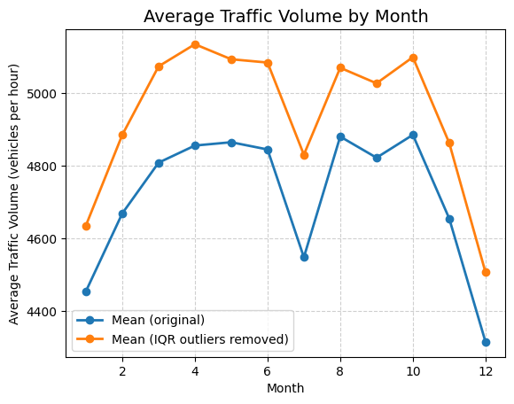
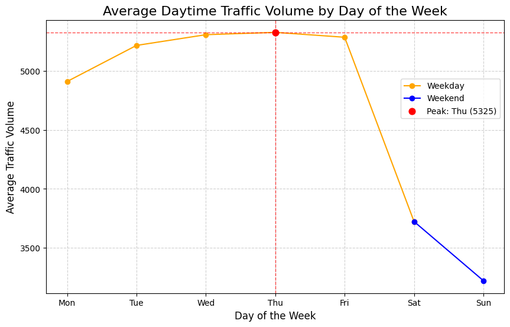
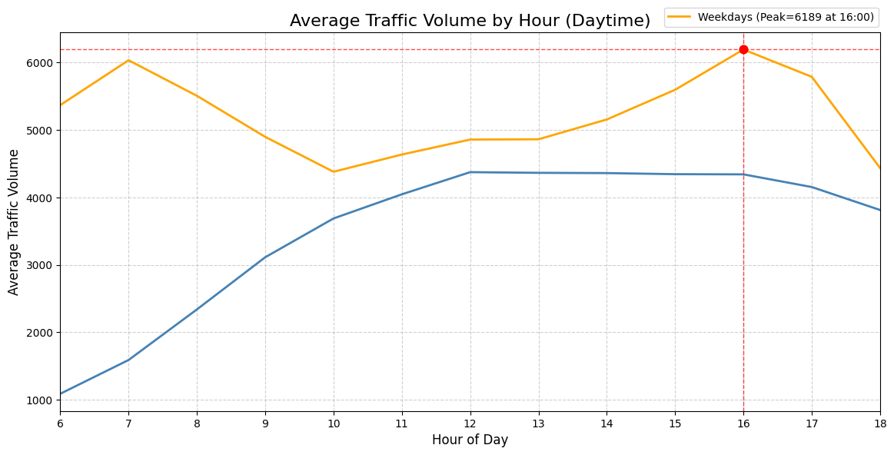
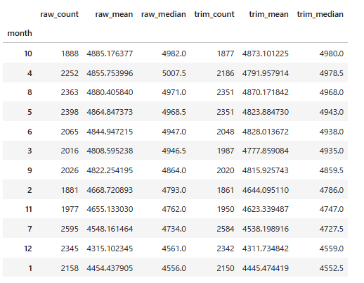
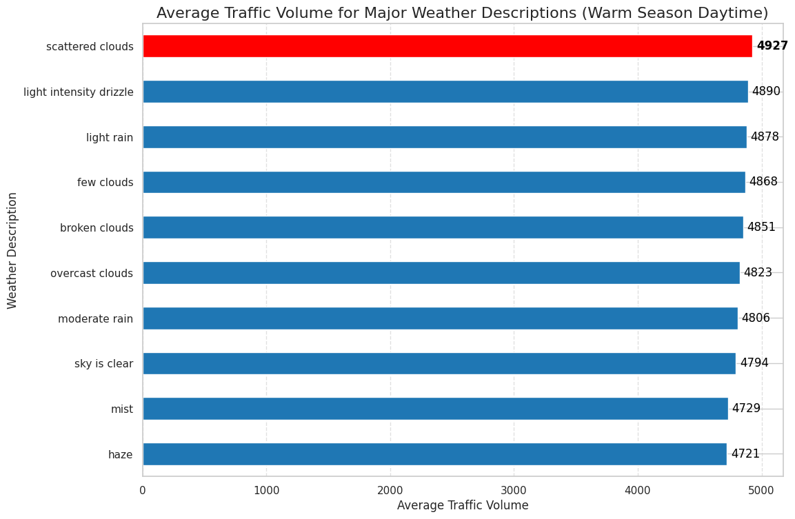
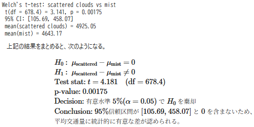

# 📊 I-94州間高速道路における「交通量ピーク」要因の分析

- **対象データ**： 州間高速道路 - 米国ミネソタ州I-94西行き（Minneapolis–St Paul間の観測点）の時間帯別交通量データ

- **目的**：交通量が多くなる条件を特定する

- **主なスキル**：
    - 探索的データ分析(EDA):
        - 折れ線グラフ・棒グラフ・散布図・ヒストグラム・ヒートマップ
        - ACF（残差など）
        - Welchのt検定
    - ウェブリサーチ


## 🚀 プロジェクト概要

本プロジェクトでは、John Hogue氏より提供されている[Interstate 94 westbound; 州間高速道路94号線西行き](https://archive.ics.uci.edu/dataset/492/metro+interstate+traffic+volume)のパブリックデータセットを用いて、下記のシナリオ設定のもと探索的データ分析(EDA)を実施する。

*   **役割:** マーケティング部 データアナリスト
*   **目的:** 新作ゲーム『データクエスト・ロワイヤル』の認知最大化
*   **施策:** I-94高速道路（西行き）のデジタルビルボード広告出稿
*   **課題:** 限られた予算で最大の広告効果を得るため、24時間放映ではなく、最適な放映タイミングを見極める
*   **ミッション:** 交通量データを分析し、「交通量が最も多くなる日時・条件（＝広告のゴールデンタイム）」を特定し、コスパの高い配信プランを提案する


### 主な分析フロー
1. **データの概要把握**
2. **データ前処理**
3. **時間的要因と交通量の関係性の分析**
    - 月と交通量の関係性の分析
    - 曜日と交通量の関係性の分析
    - 時間帯と交通量の関係性の分析
4. **気象条件と交通量の関係性の分析**
    - 気温と交通量の関係性の分析
    - 天候と交通量の関係性の分析
5. **まとめ**


### 【成果物】
- [`EDA ノートブック.ipynb`](./traffic_analysis_project.ipynb)
- [`EDA ノートブック.html`](https://yuji-re.github.io/I-94_traffic_analysis_project/index.html)
- [`EDA ノートブック.py`](./traffic_analysis_project.py)

## ✨ 要点サマリー （※ 詳細は[**まとめ**](https://yuji-re.github.io/I-94_traffic_analysis_project/index.html#conclusion)を参照）

分析結果に基づく、I-94デジタルビルボード広告運用の推奨方針は以下の通りである。

---

### 【最優先戦略：配信タイミングの最適化】

基本的な配信スケジュールの指針

<br>

<details>
<summary><h4><code> 📈 🔍 グラフ付きで確認する（テキストをクリックで展開）</code></h4></summary>

<br>

**1. 月別の交通量トレンド**  
暖かい季節（4月〜10月）に注力し、寒い季節（11月〜3月）は抑制


<br>

**2. 曜日別の交通量トレンド**  
平日を優先（特に 木・水・金 の順で優先度が高い）


<br>

**3. 時間帯別の交通量トレンド**  
16時前後をピークとする15時〜18時（夕方ラッシュ） に集中


<br>

**4. 月別交通量トレンドの簡易ロバスト性テストの結果**  
10月と4月は安定して高トラフィックが見込めるため優先配分候補


</details>

<br>

【要点まとめ】
- **曜日**: 平日を優先（特に 木・水・金 の順で優先度が高い）
- **時間**: 16時前後をピークとする 15時〜18時（夕方ラッシュ） に集中
- **月別**: 10月と4月 は安定して高トラフィックが見込めるため優先配分候補
- **季節**: 暖かい季節（4月〜10月）に注力し、寒い季節（11月〜3月）は抑制

→ **結論として、平日の夕方ラッシュ時（特に暖かい季節）をコアターゲットとする配信戦略が最も効果的である。**


---


### 【発展戦略：気象条件との連動（API活用など）】

さらなる効果改善を図る場合の指針

<br>

<details>
<summary><h4><code> 📈 🔍 グラフ付きで確認する（テキストをクリックで展開）</code></h4></summary>

<br>

**1. 天候別の交通量トレンド**  
「曇り」や「小雨」で交通量が増加傾向、「霧」や「靄（もや）」で減少傾向


**2. 「曇り」と「霧」の有意差**  
Welchのt検定の結果、平均交通量に有意差あり（約5.7%）  
しかし、標本サイズの大きさ故に検出力が高くなっている可能性があり、  
どこまで参考とするかは効果量と費用対効果を考慮して判断する必要あり


<br>

</details>

<br>

【要点まとめ】
- **狙い目**: 「曇り」や「小雨」 など、やや天候が崩れたタイミング
- **抑制**: 「霧」や「靄（もや）」 など、視界不良時

→ 予算とスケジュールに余裕があれば、天候データと連動した動的配信も検討可能。  
  **しかし、天候条件による交通量変化の効果量は小さく、費用対効果を慎重に評価する必要がある。**

<br>

> [!NOTE]
> 上記は、主要なインサイトの一部である。  
>分析過程で用いた残差ACFやヒートマップ、詳細なロジックなどを含めた文脈は
>[【成果物】](#%E6%88%90%E6%9E%9C%E7%89%A9)よりノートブック本体を参照されたい。
>
>※ なお、参照しているグラフ等はEDA段階の出力であるため、
>他者への説明を目的とした可視化（EDV）とは異なり、装飾やレイアウトの最適化がされていない点はご了承いただきたい。

---

### 💡【Next Step】

#### 【コンバージョン率向上への追加調査】

* 交通量の多さだけでなく、**ターゲット層に最もリーチできる時間帯・条件**を特定する
    * **自社ゲームのターゲット層の具体的ペルソナ設計**が必要

* **「どの条件で広告を見たとき購買意欲が高まるか」** を検討する
    * **先行研究**や**SNS等のリアルタイム情報**を参照しつつ、因果推論や行動経済学／社会心理学の観点での分析も必要

---

### 🛠 使用ツール・環境

- OS: Windows 11 + WSL2 (Ubuntu 22.04)

- 言語: Python 3.10.12

- 実行環境: VS Code: Remote - WSL + Jupyter extension  
[requirements-dev.txt](./requirements-dev.txt)を参照

- 主要ライブラリ:  
[requirements.txt](./requirements.txt)を参照
    - pandas
    - numpy
    - seaborn
    - matplotlib
    - statsmodels
    - rpy2

##### 最小セットアップ手順

```
pip install -r requirements.txt

# (Optional) notebook execution helpers
pip install -r requirements-dev.txt
```
※ rpy2のセットアップには、R本体のインストールが必要です。

##### 個人的な開発フロー（再現には不要）

- エディタ: Neovim
- Notebook連携: nvim-jupy-bridge(Neovim - VS Code Notebook Sync Runner)
  - リポジトリ / ドキュメント: [nvim-jupy-bridge](https://github.com/Yuji-RE/nvim-jupy-bridge)（現在非公開）

---

### 🗂 データセット構造

- 出典: [UCI Machine Learning Repository: Metro Interstate Traffic Volume Data Set](https://archive.ics.uci.edu/dataset/492/metro+interstate+traffic+volume)
- 提供者: John Hogue氏

- **内容**：ミネソタ州 I-94（西行き）の交通量（MN DoT *ATR station 301*）を、**1時間単位**で記録したデータ
- **期間**：2012〜2018年（時刻はローカルタイムゾーン）
- **行数**：48,204
- **列数**：9
- **ファイル**：`Metro_Interstate_Traffic_Volume.csv.gz`（Size: 395.9 KB）

| Column | Role | Type | Description | Units |
|---|---|---|---|---|
| `holiday` | Feature | Categorical | US national holidays + regional holiday (e.g., Minnesota State Fair) | - |
| `temp` | Feature | Continuous | Average temperature | Kelvin |
| `rain_1h` | Feature | Continuous | Rain amount in the hour | mm |
| `snow_1h` | Feature | Continuous | Snow amount in the hour | mm |
| `clouds_all` | Feature | Integer | Cloud cover | % |
| `weather_main` | Feature | Categorical | Short weather description | - |
| `weather_description` | Feature | Categorical | Longer weather description | - |
| `date_time` | Feature | Date | Hour of the data collected (local CST) | - |
| `traffic_volume` | Target | Integer | Hourly reported westbound traffic volume (ATR 301) | vehicles/hour |


## 🔭 技術的振り返り・改善点

- **欠損を含む時系列データ扱い**：  

“標本サイズの大きさを過信し、欠損による連続性や等間隔性への影響を過小評価して分析してしまった”  

→ 時系列補間や類似パターンによる補完などの技術を適用し、影響を最小限に抑える処理が必要

<div align="center">***</div>

- **多変量解析へのステップアップ**：  
“「時間帯」と「気象条件」をそれぞれ独立した要因として交通量との関係を分析してしまった”  

→ 交通量の分析において「天気と時間」は独立でないため、こうした交絡因子を制御できる重回帰モデルによる要因分析を検討する

<div align="center">***</div>

- **統計的厳密性の向上**：  
“第一種の過誤のリスクが高まるにも関わらず、棒グラフで差がみられたペアに対して検定（多重比較）を行ってしまった”  

→ 多重比較補正（Holm/Bonferroni/Turkey）など、より厳密な検定手法の習得が必要

<div align="center">***</div>

- **コード管理と一貫性の担保**：  
“長期化した分析プロセスにおいて、変数名やグラフのラベル定義、コード構成の一貫性が損なわれてしまった”  

→ 命名規則の策定やスタイルガイドの適用など、分析の初期段階から可読性と再現性を維持し続けるためのワークフロー確立が必要

<hr>

🔴 「傾向把握」を目的としたEDAフェーズでは許容範囲になり得るが、
プレゼンテーション用途の可視化（EDV）や
将来的に厳密なモデル構築や分散評価を行う際は、これらの点に注意すべきである

---

#### 展望・成長課題

次回以降のプロジェクトでは、今回実現できなかった以下の点を意識する。

- 🎯 **ビジネスインパクトを直感的に伝えるために、効果量の算出など、具体的数値の提示を増やす**

- 「欠損・外れ値の扱い」について、明確な基準を設け、ルールやポリシーを定義する

- 再利用性、testability、readability向上のためのコードの関数化

- 回帰でも分類でも、「モデル」をひとつ取り入れる（「EDA→前処理→モデル作成→評価」まで通して行う）

---

### ⚠️ 免責事項

本プロジェクトは学習目的で作成されたものであり、企業内での業務経験や特定企業との関係性を示すものではありません。

また、Github上で公開することでポートフォリオとしての活用を想定しています。

---

※ 本プロジェクトは[Dataquest](https://www.dataquest.io/)のガイド付きプロジェクト["Finding Heavy Traffic Indicators on I-94"](https://github.com/dataquestio/solutions/blob/master/Mission524Solutions.ipynb)をベースにしています。

###### 【ガイドに沿って実装したもの】（主に前半部分）
- データ分析の目的
- データの読み込み・前処理
- ・昼/夜別・月/曜日/時間別の基本的な可視化 など

###### 【自分で設計・実装したもの】（主に後半部分）
- 上記の基本フローに加えた、より具体的なロジックの深堀り
- 可視化グラフや出力フォーマットの視認性を上げる工夫（ピークの強調、ソート、リッチ出力や要約表示など）
- 2016年7月の交通量急落の深堀り（外部ニュース・気象データ・現地カレンダーの調査など）
- 2014-2015年の欠損値深堀り
- 各気象条件の標本サイズの偏りの検証とフィルタリング
- ACF、残差ACFによる自己相関分析
- rpy2を用いたWelchのt検定
- ヒートマップによる相対頻度分析
- 課題設定や結論 など
